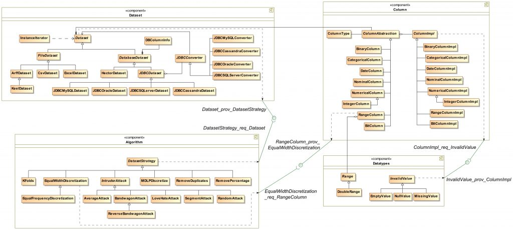
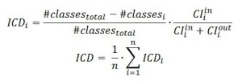
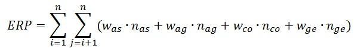
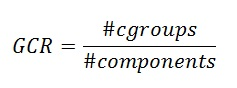
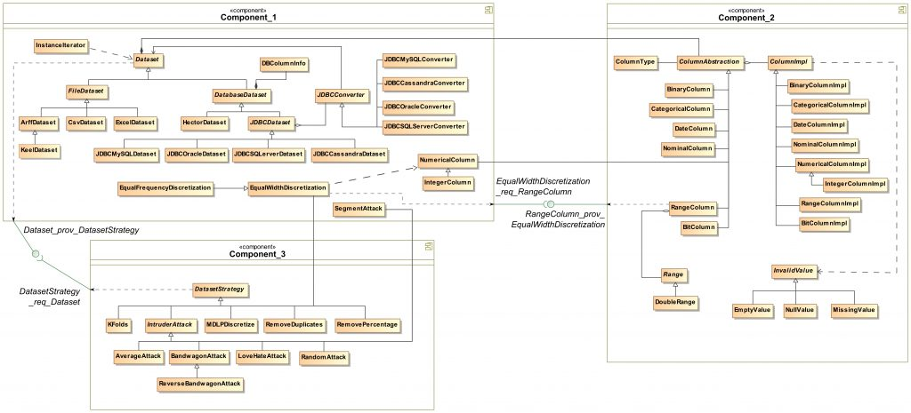

Publication
-----------

A. Ramírez, J.R. Romero[\*](http://jrromero.net/) and S. Ventura. ["An approach for the evolutionary discovery of software architectures"](https://doi.org/10.1016/j.ins.2015.01.017). _Information Sciences_, vol. 305, pp. 234-255. 2015.

Abstract
--------

Software architectures constitute important analysis artefacts in software projects, as they reflect the main functional blocks of the software. They provide high-level analysis artefacts that are useful when architects need to analyse the structure of working systems. Normally, they do this process manually, supported by their prior experiences. Even so, the task can be very tedious when the actual design is unclear due to continuous uncontrolled modifications. Since the recent appearance of Search Based Software Engineering, multiple tasks in the area of Software Engineering have been formulated as complex search and optimisation problems, where Evolutionary Computation has found a new area of application. This paper explores the design of an evolutionary algorithm for the discovery of the underlying architecture of software systems. Important efforts have been directed towards the creation of a generic and human-oriented process. Hence, the selection of a comprehensible encoding, a fitness function inspired by accurate software design metrics, and a genetic operator simulating architectural transformations all represent important characteristics of the proposed approach. Finally, a complete parameter study and experimentation have been performed using real software systems, looking for a generic evolutionary approach to help software engineers towards their decision making process.

Highlights
----------

*   A ranking based EA for the discovery of software architectures is proposed.
*   An expert-oriented model based on a comprehensible encoding and genetic operator.
*   A complete experimental analysis of the algorithm setup is carried out.

Additional material
-------------------

### An illustrative example

To illustrate the proposal, we compare here a manually produced architectural design against its corresponding automatically produced specification. Please notice that we should keep in mind some previous considerations on this regard:

*   The manually produced specification does not strictly need to be the best design for the system under study. This is one among other many possible human-based representations.
*   The automatically produced specification does not strictly need to be better than all the manually produced specifications, but it has to coherently serve as input to make the subsequent human-centered decision-making process easier.
*   This optimization process is focused on the non-functional requirements represented by the design metrics explained in the paper. However, the manually produced design is likely to be conceived on the basis of many other factors, like the experience and skills of the software engineer, other undocumented choices during the design process, etc.

Therefore, even when both approaches should be carefully compared, it is a really interesting exercise to better understand the proposal and reach conclusions about the potential use of this challenging approach. For readability purposes, this example is focused on one representative case study, called [Datapro4j](http://www.jrromero.net/tools). Throughout this section, we will discuss further details about the design specification and fitness evaluation, and compare both approaches.

#### **Manually produced specification**

Figure 1 shows the original design of the Datapro4j architecture, a Java library for data processing. As can be observed, four components are identified: _Dataset_, _Column_, _Algorithm_ and _Datatypes_. The evaluation of this architectural specification in terms of the three considered design metrics is explained below. 


Figure 1. Original manually produced architectural design of Datapro4j

As explained in the paper, the three design metrics used to evaluate the design are the following:

*   ICD: Intra-modular Coupling Density (to be maximized)



*   ERP: External Relations Penalty (to be minimized)



*   GCR: Groups/Components Ratio (to be minimized)



Firstly, we calculate each of these metrics for the architectural specification created by the software engineer. The ICD metric requires the number of classes, internal relationships and external relationships within each component composing the architecture:

| Component    | Classes | CI<sup>in</sup> | CI<sup>out</sup>|
| ------       | ------- |------|------|
| *Dataset*    | 20 | 20 | 1|
| *Algorithm*  | 14 | 13 | 2|
| *Column*     | 19 | 18| 1|
| *Datatypes*  | 6  | 4| 1|
| **Total**    | 59 | - | - |

Then, the ICD metric is calculated as follows:

```
ICD(Dataset)= ((59-20)/59)\*(20/(20+1)) = 0.63

ICD(Algorithm) = ((59-14)/59)\*(13/(13+2)) = 0.66

ICD(Column) = ((59-19)/59)\*(18/(18+1)) = 0.64

ICD(Datatypes) = ((59-6)/59)\*(4/(4+1)) = 0.72

ICD = (0.63+0.66+0.64+0.72)/4 = 0.66
```

Now, the number of external relationships between each pair of components has to be counted in order to calculate the ERP metric:

|     | *Dataset* | *Algorithm* | *Column* | *Datatypes* |
| ------       | ------- |------|------|------ |
| *Dataset*    | - | 0 | 1 composition | 0 |
| *Algorithm*  | - | - | 0 | 0 |
| *Column*     | - | - | - | 1 aggregation|
| *Datatypes*  | - | - | - | - |

Then, the ERP value is calculated as follows:

```
ERP = (3\*1)+(3\*1) = 6.00
```

Finally, the GCR metric is obtained considering the number of groups of classes in each component:

|  Component   | cgroups |
| ------       | ------- |
| *Dataset*    | 1 |
| *Algorithm*  | 1 |
| *Column*     | 1 |
| *Datatypes*  | 2 |

Then, the GCR value is calculated as follows:

```
GCR = (1+1+1+2)/4 = 1.25
```

In short, the resulting values of these metrics with respect to the original design are the following:

```
ICD=0.66

ERP=6.00

GCR=1.25
```

#### **Evolutionary solution for the architecture discovery problem**

After 30 runs of the algorithm with different seeds, the solution returned with the highest fitness value is depicted in Figure 2. 


Figure 2. Architectural solution produced by the evolutionary algorithm for Datapro4j

Its values for each individual metric are the following: (these values have been automatically computed and returned by the algorithm):

```
ICD = 0.62

ERP = 18.00

GCR = 1.67
```

From the evolutionary perspective, notice that the greatest difference found between two values is observed for the ERP metric. In this case, we should consider two additional aspects that may influence in this specific measure:

1.  Even though both architectural solutions are similar, there is a slight difference between the number of external relationships depicted in the human solution and in the evolutionary solution. In absolute terms, two interdependencies versus four. In the manually produced solution, these interrelations are one aggregation and one composition. However, in the evolutionary solution, these four interdependencies are mostly generalizations (3), which notably increase the ERP value because of the weight _wge_.

2.  We need to consider that this approach is conceived for discovering an initial architectural specification. To be fair, the same weight values have been applied to both solutions, making use of the values explained in the paper. Nevertheless, the manually produced solution, which would not exist in a real case, does not strictly need to follow these specific values, but the software engineer might have had other considerations in mind.

From the architectural perspective, notice that this evolutionary solution has a similar global structure than the one obtained by the human, where some components clearly look similar to those specified in Figure 1, e.g. _Component\_1_ and _Component\_3_ could be matched with _Dataset_ and _Algorithm_, respectively. The other component, named _Component\_2_, aggregates the classes originally assigned to the components _Column_ and _Datatypes_. In fact, the algorithm has generated this component as a way to remove the external aggregation between both components in the original design. Moreover, it also serves to constitute a unique group of classes inside the component. With respect to the distribution of classes, only a few of them (namely _SegmentAttack_, _EqualFrequencyDiscretization_, _EqualWidthDiscretization_, _IntegerColumn_ and _NumericalColumn_) have been assigned to a different component than that proposed in the original design. Nevertheless, it does not hamper the readability of the model since the key classes of each component are properly identified. The candidate architecture clearly seems to serve as a support to complete the subsequent decision making process.
